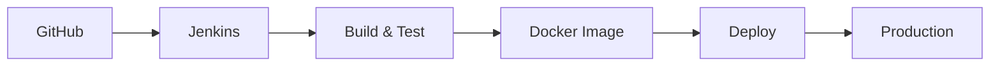

<h1 align="center">Hi 👋, I'm Dilnawaz Khan</h1>

<h3 align="center">DevOps Engineer | Cloud Infrastructure | CI/CD | Docker | Jenkins | Kubernetes | Linux |Windows</h3>

  

  
  
  

---

## About Me

I'm a DevOps Engineer with **7+ years of experience** in IT operations, production support, cloud infrastructure, CI/CD, monitoring, automation, deployments, and troubleshooting.

- ☁️ Manage infrastructure across **AWS and GCP**
- 🔄 Build, monitor, and troubleshoot **CI/CD pipelines**
- 🐳 Deploy and support applications using **Docker and Kubernetes**
- 🐧 Administer **Linux** production environments
- 📊 Monitor applications and infrastructure using **Grafana, Nagios, Zabbix, and Datadog**
- 🔧 Investigate incidents, analyze logs, and perform **root cause analysis**
- 🤖 Automate repetitive operational tasks with **Bash/Shell scripting**
- 🤝 Collaborate with development, operations, and support teams

## Technical Skills

| Category | Technologies |
|---|---|
| Cloud | AWS, GCP |
| Containers & Orchestration | Docker, Docker Compose, Kubernetes |
| CI/CD | Jenkins, Octopus Deploy |
| Version Control | Git, GitHub |
| Operating Systems | Linux | windows 
| Scripting | Bash, Shell scripting, PowerShell |
| Monitoring & Observability | Grafana, Nagios, Zabbix, Datadog, CloudWatch, Google Cloud Monitoring |
| Web Servers | Nginx |
| Databases | MySQL, PostgreSQL |

  

## Cloud & Infrastructure

### AWS

`EC2` · `S3` · `IAM` · `VPC` · `CloudWatch` · `Load Balancing` · `Security Groups`

### Google Cloud Platform

`Compute Engine` · `Cloud Storage` · `IAM` · `VPC` · `Cloud Monitoring` · `Infrastructure Management`

## Containers & Kubernetes

- Build and manage Docker images and containers
- Write Dockerfiles and manage multi-container applications with Docker Compose
- Deploy and operate Kubernetes workloads using Pods, Deployments, and Services
- Manage ConfigMaps, Secrets, namespaces, and application scaling
- Troubleshoot container and Kubernetes application issues

## CI/CD & Automation

- Configure and monitor Jenkins pipelines
- Integrate GitHub repositories with CI/CD workflows
- Troubleshoot failed builds and deployments
- Automate application builds and Docker image creation
- Support releases and production deployments
- Automate operational tasks using Bash and PowerShell

## Featured Projects

### CI/CD Pipeline Automation

**Technologies:** `Git` `GitHub` `Jenkins` `Docker` `Linux`

- Configured Jenkins pipelines and GitHub integrations
- Automated builds, tests, and Docker image creation
- Supported deployments, releases, and pipeline troubleshooting

### Production Monitoring & Incident Response

**Technologies:** `Linux` `Grafana` `Nagios` `Zabbix` `Datadog`

- Monitored server health, applications, and production services
- Investigated alerts through log and performance analysis
- Managed incidents and performed root cause analysis
- Supported alert automation and service recovery workflows

### Cloud Infrastructure Support

**Technologies:** `AWS` `GCP` `Linux`

- Managed cloud compute, storage, networking, IAM, and security controls
- Monitored infrastructure health and resource utilization
- Supported deployments and resolved production incidents

## GitHub Statistics

  
  

  

## Currently Learning

- Advanced AWS and GCP
- Kubernetes and container operations
- CI/CD and infrastructure automation
- Cloud architecture and security
- Monitoring, observability, and DevOps best practices

## Career Objective

I aim to grow as a highly skilled DevOps Engineer by contributing to challenging cloud, infrastructure, automation, and platform engineering projects while building reliable, secure, and scalable systems.

## Connect With Me

- **GitHub:** [Dilnawazdevops](https://github.com/Dilnawazdevops)
- **LinkedIn:** [Dilnawaz Khan](YOUR_LINKEDIN_URL)
- **Email:** [rajp85916@gmail.com](mailto:rajp85916@gmail.com)

---

<i>Open to connecting and collaborating on DevOps, cloud, automation, and infrastructure projects.</i>

